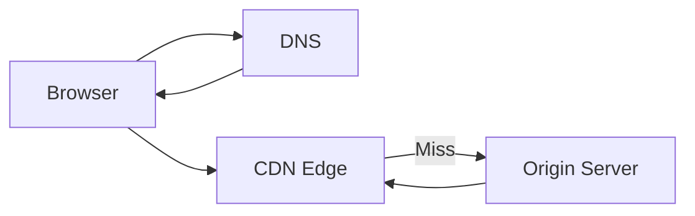

# CDN (Content Delivery Network)

Distributes static and dynamic content closer to end-users globally, 
improving latency and reliability for web applications.

## What is it?

A Content Delivery Network (CDN) is a geographically distributed network 
of proxy servers and cached data centers. It caches copies of frequently 
accessed assets—such as images, videos, CSS, and JavaScript files—at 
various Point-of-Presence (PoP) locations worldwide. When a user makes a 
request for content, the CDN directs that request to the closest available 
edge node rather than forcing it back to the primary origin server. This 
decentralized architecture minimizes network latency and significantly 
reduces the load placed on the core infrastructure.

## Why do we need it?

CDNs solve the problem of distance-dependent latency inherent in c
centralized architectures. As user bases grow globally, relying solely on 
a single origin data center introduces unacceptable delays (high Time To 
First Byte) for distant users. Furthermore, high traffic volume can 
overwhelm the origin server's network bandwidth and processing capacity. A 
CDN provides critical scaling by offloading static content requests to its 
distributed edge cache layer. This ensures faster perceived performance 
and higher resilience during traffic spikes.

## How does it work?

The process involves intercepting client requests before they reach the 
main infrastructure.
1. The user's device resolves the hostname, but instead of resolving to 
the origin IP, the DNS points the request to the nearest CDN edge node 
PoP.
2. The edge node intercepts the content request and checks its local 
cache using a primary key (e.g., object URI).
3. If a valid asset is found in the cache (a cache hit), the edge node 
immediately serves the content to the user, resulting in low latency.
4. If the content is not present or has expired (a cache miss), the edge 
node fetches the asset from the configured origin server. It then caches a 
copy of that asset for future requests before sending it back to the 
client.
5. The TTL (Time-To-Live) dictates how long the asset remains cached at 
the edge node.

## Architecture Diagram

## Common Configurations

| Configuration | Description |
| :--- | :--- |
| **Cache Control Headers** | Defines TTLs and caching rules (e.g., 
`Cache-Control: max-age`) for cached assets, determining cache validity at 
the edge. |
| **Origin Shielding** | Implements an intermediate layer of caching 
between the PoPs and the origin to minimize redundant requests hitting the 
core infrastructure. |
| **Custom Error Handling** | Allows redirection or serving specific 
static content when accessing non-existent resources (404 handling). |
| **WAF Integration** | Deploys Web Application Firewalls at the edge 
layer to inspect traffic and mitigate common attack vectors like XSS or 
DDoS. |

## Where is it used?

*   **Streaming Video:** Delivering video chunks globally with consistent 
quality and low buffering times.
*   **Static Websites:** Hosting entire single-page applications (SPAs) 
and static asset bundles for rapid deployment.
*   **Global APIs:** Caching read-only or infrequently changing API 
responses to reduce latency for backend service calls.
*   **E-commerce Platforms:** Serving product images, logos, and s
stylesheet assets during high-traffic sales events.

## Key Points

*   Operates as a distributed reverse proxy layer situated between the 
client and the origin server.
*   Caching efficiency is fundamentally dependent on proper HTTP caching 
headers (e.g., ETag, Cache-Control).
*   Handles request routing based on geography, directing traffic to the 
topologically nearest PoP.
*   Typically enhances availability by absorbing a significant portion of 
volumetric DDoS attack traffic at the edge.
*   Edge processing allows for running simple logic (like header m
manipulation or A/B routing) without involving the origin compute layer.

## Related Components

*   API Gateway
*   DNS
*   Load Balancer
*   Object Storage

## Learn More

Cache Coherency
HTTP Caching Headers
PoP Deployment
Anycast Networking

