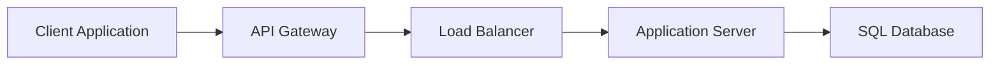

# Client

A software entity that initiates requests and consumes services exposed by 
a backend system or API. The client interacts with an service boun
boundary—such as an API Gateway—to access required business functionality 
without requiring direct knowledge of the internal microservice topology.

## What is it?

The client acts as the initiating endpoint for all data requests within a 
distributed system context. It embodies the consumer side of a com
communication contract, utilizing specific SDKs or HTTP clients to 
communicate with downstream services. Critically, modern enterprise 
systems treat the application component making the request as the 
effective client. The client must manage serialization, authentication 
headers, and coordinate connection state management according to e
established API contracts.

## Why do we need it?

In microservices architectures, direct point-to-point communication 
between all service consumers is unscalable and fragile. The Client layer 
standardizes interaction points, abstracting away underlying network 
complexities like service discovery, load balancing logic, and protocol 
heterogeneity. It allows services to evolve independently while gu
guaranteeing that the consumer interface remains stable through es
established compatibility layers.

## How does it work?

The request flow initiates with the client constructing a payload and 
specifying the target resource endpoint. The client’s internal networking 
stack then handles several steps before transmission:

1.  **Discovery:** It contacts a Service Discovery registry to obtain the 
network location (IP:Port) of the required service boundary.
2.  **Routing:** A Load Balancer or API Gateway receives the request and 
forwards it to an available instance.
3.  **Authentication:** Edge components validate the client's credentials 
(e.g., OAuth token, API key) against identity providers.
4.  **Dispatch:** The gateway proxies the validated request payload to the 
target backend microservice, applying necessary traffic management rules 
like rate limiting and circuit breaking before a response is returned 
through the network stack.

## Architecture Diagram

## Common Configurations

| Configuration | Description |
| :--- | :--- |
| `request_timeout` | Maximum duration the client waits for an entire 
response cycle. |
| `retry_count` | The number of times the client attempts a failed request 
before failing permanently. |
| `backoff_strategy` | Algorithm (e.g., exponential) determining the delay 
between retry attempts. |
| `auth_scope` | Defines the specific permissions or scopes required for 
the API call. |
| `connection_pool_size` | The maximum number of persistent connections 
maintained to a single service endpoint. |

## Where is it used?

*   **Mobile Applications:** Consuming APIs hosted at an Edge Gateway 
following OAuth authorization flows.
*   **Web Frontends (SPA):** Interacting with Backend-for-Frontend (BFF) 
services which aggregate multiple microservice calls.
*   **Internal Microservices:** Using SDKs to call other internal domain 
services, managed by a Service Mesh proxy.
*   **IoT Devices:** Implementing resource-constrained communication 
protocols (e.g., MQTT) to send telemetry data.

## Key Points

*   Client implementations dictate the compatibility contract between 
services.
*   Handling transient network failures requires configured retry logic 
and backoff strategies.
*   Service discovery ensures clients resolve logical service names into 
physical network endpoints dynamically.
*   Authentication must be handled at an ingress point to validate client 
identity before business logic execution.
*   Timeouts and circuit breakers prevent cascading failures due to slow 
or failing dependencies.

## Related Components

*   API Gateway
*   Load Balancer
*   Application Server

## Learn More

Idempotency
Circuit Breaker Pattern
Exponential Backoff
Rate Limiting

