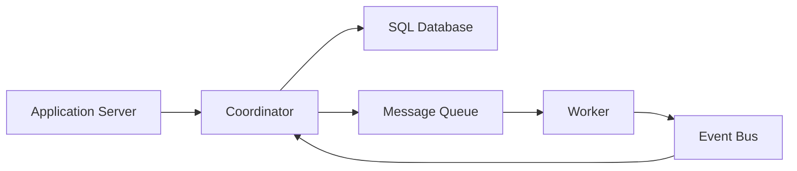

# Coordinator

Manages and executes complex workflows by maintaining state transitions 
across multiple independent microservices or worker nodes.

## What is it?

The coordinator component is a dedicated service responsible for o
orchestrating distributed business processes that cannot be executed 
atomically within a single transaction boundary. It acts as the central 
authority for managing the lifecycle of an operation, tracking which steps 
have completed successfully and determining appropriate fallback actions 
upon failure. Instead of tightly coupling services, the coordinator 
defines the sequence and dependencies, ensuring eventual consistency 
across the entire system while mitigating race conditions inherent in 
distributed environments.

## Why do we need it?

Complex business logic often spans multiple domain boundaries (e.g., 
inventory deduction, payment processing, notification sending). Without a 
coordinating component, managing these multi-step workflows requires 
brittle transaction management or complex compensating transactions spread 
across service clients. The coordinator solves the problem of ensuring 
that partial failures do not leave the overall system in an inconsistent 
state, particularly when services communicate asynchronously over message 
queues. It provides reliability guarantees for mission-critical processes.

## How does it work?

The process initiates when a client sends a request payload to the 
coordinator's API endpoint. The coordinator first validates the input and 
initializes the workflow state record within its persistent store (e.g., 
storing `State: PENDING`). Next, based on the defined workflow graph, it 
dispatches the initial task message to the first required worker service 
via a Message Queue.

1.  The worker service processes the task and emits a success/failure 
event back to a dedicated topic.
2.  The coordinator consumes this event, updates its state record, and 
evaluates the next step in the defined workflow graph.
3.  If successful, it dispatches a new message to the subsequent worker or 
service group. If the step fails, the coordinator executes pre-defined 
compensation logic (rollback) or signals a permanent failure status.

## Architecture Diagram

## Common Configurations

| Configuration | Description |
| :--- | :--- |
| **Timeouts** | Maximum duration allowed for a single step's worker 
acknowledgment. Critical for preventing workflow stalling. |
| **Retry Backoff Strategy** | Defines the exponential or linear delay 
used when resubmitting a failed task to prevent overwhelming failing 
services. |
| **State Machine Definition Language** | Specifies the format (e.g., 
YAML, JSON) used to declaratively define transitions and failure paths for 
the workflow. |
| **Idempotency Key TTL** | Time-to-live for the unique key provided by 
the client to ensure that retries do not execute the same operation 
multiple times. |
| **Compensation Policy** | Determines the compensation mechanism (e.g., 
dedicated service call, message queue replay) upon step failure. |

## Where is it used?

*   E-commerce Order Placement: Orchestrating inventory reservation, 
payment processing, and email notification.
*   Account Provisioning: Managing complex user onboarding that involves 
identity verification, directory enrollment, and initial resource setup.
*   Data Migration Pipelines: Coordinating sequential data transformations 
across multiple source systems into a centralized data warehouse.

## Key Points

*   The coordinator maintains system state persistence independent of the 
worker services.
*   Workflows are modeled as Directed Acyclic Graphs (DAGs) or State 
Machines.
*   It is mandatory for handling eventual consistency requirements in 
distributed transactions.
*   Compensation logic must execute business-level rollbacks, not just 
technical retries.
*   The coordinator component minimizes the need for two-phase commit 
protocols.
*   Decoupling services allows workers to scale independently of the 
coordination logic.

## Related Components

*   Message Queue
*   SQL Database
*   Worker
*   Event Bus

## Learn More

Saga Pattern
Eventual Consistency
Idempotency
Orchestration vs Choreography

