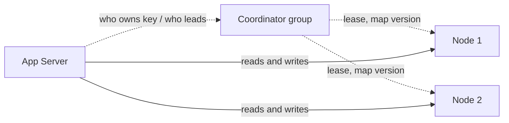

# Coordinator

A small replicated group that agrees, by majority, on the facts a distributed
system cannot afford to have two answers to: who leads, who holds a lock, which
node owns which key.

## What is it?

A coordinator is the system's **control plane**. It holds a handful of small,
critical facts - the placement map, current leadership, lock ownership,
membership - and guarantees every caller sees the same version of them. It
never carries application data: callers ask it a question, cache the answer,
and send their reads and writes straight to the node it named.

It runs as three or five members that agree on every change through a
consensus protocol (Raft, Paxos or ZAB). ZooKeeper, etcd and Google's Chubby
are all coordinators in this sense.

## Why do we need it?

Once data or work spans machines, some decisions must have exactly one answer.
If each app instance carries its own copy of "which node owns seeker 88123",
changing it means the copies disagree until the last deploy lands. If two
replicas each decide on their own that the primary is dead, both start
accepting writes - split brain.

A coordinator puts each of those decisions in one place, versioned, and makes
the change only when a majority of its members agree. A minority cut off by a
network partition cannot change anything, so at most one side of a split can
act.

## How does it work?

1. Every change - a new map version, a new leader, a granted lock - is proposed
   to the group and committed only once a majority of members have recorded it.
2. Each committed change carries an increasing number (a map version, a term, a
   fencing token), so a stale answer is visibly stale.
3. Nodes send heartbeats or renew leases. A node that stops renewing loses its
   role or lock when the lease runs out, whether or not it noticed.
4. Callers fetch answers, cache them, and refresh when a storage node or peer
   rejects a request stamped with an old version.

## Architecture Diagram

```mermaid
graph LR
    A[App Server] -.->|who owns key / who leads| C[Coordinator group]
    C -.->|lease, map version| N1[Node 1]
    C -.->|lease, map version| N2[Node 2]
    A -->|reads and writes| N1
    A -->|reads and writes| N2
```

Every edge into or out of the Coordinator is a `control` edge: questions about
the system, never data.

## Common Configurations

| Configuration | Description |
| :--- | :--- |
| **Consensus Protocol** | The agreement algorithm the group runs: Raft, Paxos or ZAB. All three need a majority; they differ in how leadership and log ordering are handled internally. |
| **Group size** | Three members survive one failure, five survive two. Even sizes add a machine without adding tolerance. |
| **Lease / session timeout** | How long a node keeps a role or lock without renewing. Shorter means faster failover and more false alarms. |

## Where is it used?

*   **Placement:** which shard or key range lives on which storage node (3.22).
*   **Leader election:** which database node may accept writes, with terms
    fencing the old leader (3.26).
*   **Distributed locks:** one run of a job at a time across machines (3.23).
*   **Membership and configuration:** which nodes are alive, and settings every
    instance must agree on.

## Key Points

*   It decides where data goes and who may act; it never carries the data.
*   Majority agreement is what prevents two answers: run 3 or 5 members, never 2.
*   Spread members across failure domains, or one outage takes the majority.
*   If it goes down, cached answers keep traffic flowing; only changes stop.
*   Every request through it pays a consensus round trip, so keep it off the
    request path.

## Related Components

*   Leader
*   Follower
*   Lock Service
*   NoSQL Database

## Learn More

Consensus (Raft, Paxos)
Quorum
Split Brain
Fencing Tokens
