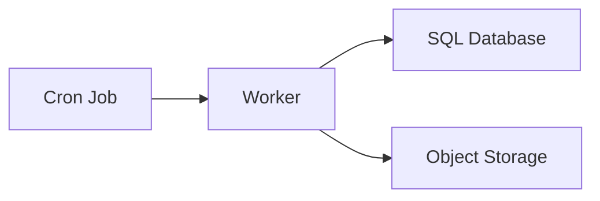

# Cron Job

Executes scheduled, time-based tasks on a defined recurring schedule.

## What is it?

A cron job executes specific commands or scripts at pre-defined intervals 
determined by a cron expression. It functions as an automated scheduler 
within an operating system or orchestration layer, allowing engineers to 
decouple recurring maintenance or batch processing from the primary 
application workflow. This component manages execution metadata—such as 
the schedule and payload—ensuring tasks run reliably without continuous 
human intervention. It is essential for maintaining data hygiene, running 
periodic reports, and triggering scheduled state transitions across 
distributed services.

## Why do we need it?

Cron jobs solve the problem of executing stateless operations that must 
occur deterministically at fixed times or intervals. Without them, 
critical background processes—like nightly database cleanups, metric 
aggregation, or cache invalidations—require manual intervention or complex 
real-time triggering logic within an active service endpoint. They provide 
a reliable mechanism for scheduled workload management, ensuring necessary 
maintenance tasks execute even when the primary application is idle or 
undergoing scaling events.

## How does it work?

The process begins with defining a cron schedule using a standard cron 
expression (e.g., `* * * * *` for every minute). The scheduler component 
constantly monitors these defined schedules. When the current time matches 
an active job's cron criteria, the scheduler triggers the execution 
container or task runner. This runner loads the specified payload (script 
or command) and executes it in a segregated environment, providing 
standardized input/output capture and status reporting. Upon completion, 
the system records the exit code and associated metrics, allowing 
monitoring systems to detect failures immediately, triggering necessary 
alerts for intervention.

## Architecture Diagram

## Common Configurations

| Configuration | Description |
| :--- | :--- |
| `CRON_EXPRESSION` | Defines the execution frequency using standard cron 
format. |
| `MAX_RETRIES` | Specifies the maximum number of times a failed job will 
automatically rerun. |
| `TIMEZONE` | Sets the timezone used to evaluate scheduled execution 
time. |
| `JOB_TIMEOUT_SECONDS` | Limits the maximum allowable runtime for any 
single job execution instance. |
| `SECRET_ARN` | Provides credentials or temporary access keys required by 
the job payload. |

## Where is it used?

*   **Database Management:** Running daily schema migrations, index 
rebuilds, or data archival processes.
*   **Metrics and Reporting:** Aggregating time-series metrics into 
weekly/monthly rollup tables.
*   **Cache Invalidation:** Deleting stale records from distributed caches 
(e.g., session tokens older than 30 days).
*   **User Lifecycle:** Sending periodic digests, reporting status 
updates, or processing expirations of credentials.

## Key Points

*   Jobs operate asynchronously and are isolated from the main request 
path.
*   Failure handling typically involves exponential backoff and retry 
mechanisms.
*   The scheduler manages time synchronization across distributed nodes.
*   Resource quotas (CPU, memory) must be defined per job to prevent 
resource exhaustion.
*   Results and logs are typically streamed to centralized logging 
platforms for auditing.

## Related Components

*   Message Queue
*   Worker
*   Distributed Cache

## Learn More

Concurrency Models
State Machines
Quartz Scheduler

