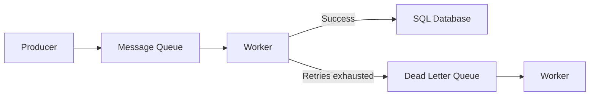

# Dead Letter Queue (DLQ)

A dedicated queue designed to hold messages that could not be successfully 
processed by a primary consumer group after exhausting defined retry 
attempts or due to structural invalidity.

## What is it?

A Dead Letter Queue is an auxiliary endpoint within an asynchronous 
messaging architecture. It captures specific types of message failures, 
preventing them from being continuously retried in the main processing 
queue. DLQs typically store messages that consumers deem "poison m
messages"—messages that consistently fail due to unrecoverable data 
corruption or schema mismatch. The component facilitates manual inspection 
and systematic re-ingestion, separating transient system errors from 
persistent data defects.

## Why do we need it?

Standard message queues utilize retries for handling transient failures 
(e.g., database deadlock, network outage). However, if a message p
perpetually fails due to inherent data problems, continuous retry attempts 
will consume resources and potentially block the entire queue's processing 
stream. DLQs solve this by providing an automatic bypass mechanism for 
poison messages. They ensure system stability by isolating unprocessable 
payloads, allowing healthy messages to continue timely consumption while 
retaining failed data for diagnostic analysis.

## How does it work?

The process begins when a Producer sends a message payload to the primary 
Message Broker Queue. The Consumer service attempts processing using its 
business logic. If an expected transient error occurs (e.g., connection 
timeout), the messaging framework initiates internal retry mechanisms and 
requeues the message. If the consumer reaches a defined maximum retry 
limit (or if the failure criteria specify data malformation), the 
messaging broker or consumer middleware intercepts the failed event. 
Instead of returning the message to the main queue, it routes the 
payload—along with metadata like the failure timestamp and exception 
type—to the dedicated Dead Letter Queue. Operators monitor the DLQ for 
actionable failures requiring code fixes or manual data correction before 
re-publishing them.

## Architecture Diagram

## Common Configurations

| Configuration | Description |
| :--- | :--- |
| `max-retries` | Defines the maximum number of processing attempts before 
a message is deemed failed and routed to the DLQ. |
| `retry-delay-seconds` | Specifies an exponential backoff period or fixed 
delay used during automatic retries before escalating failure handling. |
| `dlq-topic-suffix` | A naming convention appended to the original queue 
name (e.g., `orders-main.dlq`) ensuring clear lineage. |
| `failure-type-filter` | Allows routing only specific exception types 
(e.g., `SchemaViolationException`) rather than all failures to the DLQ. |

## Where is it used?

*   **Financial Transactions:** Handling message payloads for payment 
gateway interactions that fail due to external service unavailability or 
invalid account formats.
*   **E-commerce Order Fulfillment:** Capturing order event messages that 
repeatedly fail processing because product inventory data violates 
business constraints.
*   **IoT Device Ingestion:** Isolating telemetry readings from co
constrained devices that arrive with malformed or non-standard schema 
payloads.

## Key Points

*   DLQs should store enriched metadata, including the stack trace and 
failure count, alongside the original message payload.
*   They prevent consumers from being perpetually blocked by a single 
stream of poison messages.
*   Monitoring services must track volume growth in DLQs to proactively 
detect systematic processing failures.
*   Relying solely on retries masks underlying data defects; manual 
inspection of the DLQ is necessary for resolution.
*   DLQ ingestion generally involves an administrative process, not part 
of the standard consumer flow.
*   The system must support immutable message payloads within the queue to 
preserve auditability.

## Related Components

*   Message Queue
*   Worker
*   Event Bus

## Learn More

Idempotency
At-Least-Once Delivery
Backpressure
Deadlock Detection

