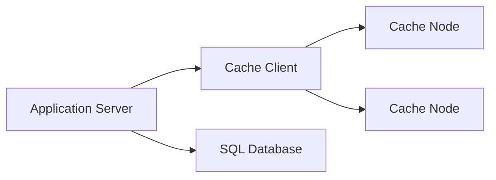

# Distributed Cache

One-line summary.
A high-speed, decentralized key-value store used to temporarily hold data 
in memory across multiple nodes, reducing latency and load on primary 
datastores.

## What is it?

A distributed cache is a cluster of interconnected, ephemeral key-value 
stores designed for extremely low-latency read/write operations. Unlike 
persistent databases, caches prioritize speed and availability over strong 
durability guarantees. They store pre-computed results, session tokens, or 
frequently accessed reference data to minimize the necessity of accessing 
the underlying persistence layer (e.g., a database). Effective caching 
significantly reduces operational load on backend services, allowing the 
application to scale horizontally with predictable performance cha
characteristics under heavy traffic.

## Why do we need it?

Distributed caches solve the problem of latency and resource bottlenecking 
inherent in persistent storage access. When an application frequently 
requests the same data—such as user profile details or rate limits
limits—querying a traditional disk-backed database introduces unacceptable 
network round trips and processing overhead. Implementing a cache layer 
intercepts these repetitive read requests, serving data directly from fast 
memory (RAM). This pattern scales throughput by absorbing read traffic 
spikes and protecting transactional databases from becoming bottlenecks 
due to excessive query volume.

## How does it work?

The distributed nature means the cache load is partitioned across multiple 
physical nodes, preventing any single machine from becoming a bottleneck. 
When an application needs data, it sends a GET request containing the key 
to the cache cluster. The caching system determines which node owns that 
key using a consistent hashing algorithm and routes the query accordingly. 
If the requested key exists (a cache hit), the value is returned i
immediately. If the key does not exist (a cache miss), the application 
service typically fetches the data from the primary database, then writes 
this newly retrieved result back into the cache before returning it to the 
user, ensuring future requests are fast.

1. The client initiates a read request for a specific `Key`.
2. The caching coordinator uses consistent hashing to identify the 
responsible cache node.
3. The request is routed to the designated node.
4. The node checks its in-memory store and returns the cached value (Hit) 
or signals missing data (Miss).
5. If it was a miss, the application service retrieves the source data 
from the primary database.
6. The application writes the fetched result back into the cache with an 
appropriate Time To Live (TTL).

## Architecture Diagram

## Common Configurations

| Configuration | Description |
| :--- | :--- |
| **Time-To-Live (TTL)** | Defines the maximum duration a key can persist 
in the cache before automatic invalidation. |
| **Eviction Policy** | Algorithm used to select and remove cached items 
when memory capacity is reached (e.g., LRU, LFU). |
| **Consistency Model** | Determines how stale data is managed between the 
primary store and the cache layer. |
| **Sharding Key/Strategy** | Specifies the mechanism (e.g., consistent 
hashing) used to partition keys across the cluster nodes. |

## Where is it used?

*   **Session Management:** Storing transient user session tokens or state 
data to allow stateless application servers.
*   **Rate Limiting:** Keeping track of request counts per user or API 
key, checking against configured thresholds before allowing a request 
through.
*   **Feature Flag Lookups:** Caching configuration flags or feature 
definitions to avoid database calls during service startup checks.
*   **API Aggregation:** Storing the results of expensive computations or 
merged data from multiple downstream services for rapid access.

## Key Points

*   Data in a distributed cache is inherently ephemeral; persistence must 
be handled by a dedicated backend store.
*   Cache invalidation mechanisms (e.g., write-through, write-back) are 
critical for maintaining data freshness.
*   Using consistent hashing ensures that adding or removing nodes 
minimizes the remapping of existing keys.
*   A cache hit is significantly faster than a database query because it 
avoids network serialization and disk I/O.
*   The choice between eventual consistency and strong consistency must be 
based on application tolerance for stale data.
*   Implementing proper monitoring of hit ratios is essential for 
optimizing caching efficiency.

## Related Components

*   Cache
*   SQL Database
*   Application Server

## Learn More

Consistent Hashing
Time To Live (TTL)
Cache Invalidation Patterns
Eventual Consistency

