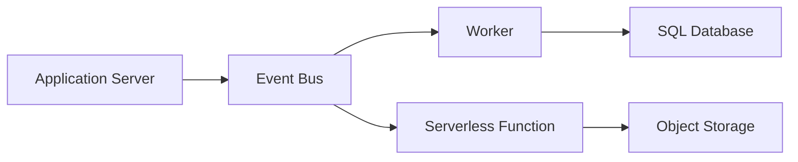

# Event Bus

A messaging infrastructure that facilitates asynchronous communication 
between decoupled services via an intermediary topic or channel.

## What is it?

An Event Bus acts as a central nervous system for microservice arc
architectures, enabling components to communicate without direct knowledge 
of each other's existence. Instead of services calling APIs synchronously, 
they publish events—immutable records of state changes—to the bus. 
Services interested in these specific events subscribe to them and react 
accordingly. This pattern promotes high cohesion within services while 
drastically reducing coupling between them, allowing independent d
deployment cycles for different parts of the system.

## Why do we need it?

Traditional request/response APIs create tight temporal coupling; a 
failure or latency spike in one service cascade across dependents. Event 
Buses solve this by moving communication to an asynchronous model. 
Services publish events when something happens and immediately detach, 
guaranteeing that the originator does not wait for consumers. This 
resilience enhances fault tolerance, allows services to scale inde
independently based on event load, and is essential for implementing 
complex distributed workflows that require eventual consistency.

## How does it work?

The process begins when a producing service modifies its state (e.g., an 
order status changes to 'Shipped'). Instead of calling downstream services 
directly, the producer emits an event payload (e.g., `OrderShippedEvent`) 
containing necessary metadata and context. This event is published to a 
specific topic on the Event Bus. The bus ingests this event and replicates 
it to all active subscribers—the consuming services. Each subscriber 
maintains its own independent consumer group, retrieves the event payload, 
and executes its business logic in isolation (e.g., inventory service 
decrements stock; notification service sends an email).

## Architecture Diagram

## Common Configurations

| Configuration | Description |
| :--- | :--- |
| **Topics** | Logical channels used to categorize streams of events 
(e.g., `user_created`, `order_updated`). |
| **Consumer Groups** | A set of consumer instances that work together to 
process a topic's events, ensuring parallel processing and load balancing. 
|
| **Persistence Policy** | Defines how long the broker retains consumed 
messages; typically configured for guaranteed message replayability. |
| **Acknowledgment Mechanism** | Specifies when an event is considered 
successfully processed (e.g., after consumer commit or manual ackn
acknowledgment). |

## Where is it used?

*   **E-commerce:** Handling `OrderSubmitted` events that trigger payment 
processing, inventory checks, and shipping notifications concurrently.
*   **Telemetry/Monitoring:** Ingesting high-volume, continuous metrics 
streams (e.g., CPU usage) where immediate synchronous feedback is not 
required.
*   **Workflow Management:** Coordinating state changes across multiple 
domain boundaries in large, distributed transaction workflows.

## Key Points

*   Decouples producers from consumers temporally and spatially.
*   Uses the publish-subscribe pattern fundamentally.
*   Achieves eventual consistency by nature of asynchronous communication.
*   Reduces blast radius; failure in one consumer does not stop event flow 
for others.
*   Requires careful handling of idempotency to prevent side effects upon 
retry.
*   Scales horizontally by adding more consumer instances per group.

## Related Components

*   Message Queue
*   Worker
*   Serverless Function

## Learn More

Eventual Consistency
Consumer Groups
Idempotency
Message Queue Patterns

