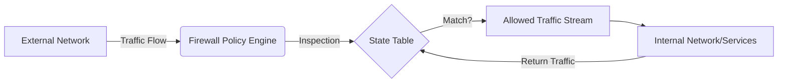

# Firewall

Filters incoming and outgoing network traffic based on predefined security 
policies, operating at multiple layers of the OSI model.

## What is it?
A firewall serves as a critical network security boundary that inspects 
data packets traversing a defined perimeter. It examines headers (like 
source/destination IP addresses and ports) and payload content to 
determine if traffic adheres to established rulesets. Functionally, it 
enforces separation between trust zones—for example, separating an 
internal private network from the public internet or isolating different 
service tiers within a cloud environment. Modern firewalls often maintain 
connection state information, allowing them to distinguish legitimate 
return traffic from malicious external probes.

## Why do we need it?
Firewalls are essential components for maintaining network segmentation 
and protecting confidential data assets. Without one, networks expose 
critical services directly to the unpredictable flow of general internet 
traffic. They solve the problem of unauthorized access attempts (r
(reconnaissance, port scanning) by acting as a mandatory choke point for 
all ingress/egress communication. Implementing robust firewalling is 
necessary whenever disparate systems or different trust levels coexist 
within the same network topology, ensuring that only authorized data flows 
are permitted.

## How does it work?
The process involves packet interception and rule evaluation upon every 
connection attempt.

1.  **Ingress:** An external packet arrives at the firewall interface.
2.  **Lookup:** The firewall first examines the Layer 3 (IP) and Layer 4 
(Port/Protocol) headers against its internal ruleset, typically processed 
in sequential order.
3.  **State Check:** If a stateful inspection is enabled, the firewall 
checks if this packet belongs to an existing, tracked connection session 
initiated from within the allowed trust zone.
4.  **Policy Evaluation:** If no match exists or if state tracking fails, 
the packet attributes (IPs, ports) are evaluated against specific rules 
(e.g., `ALLOW src=10.0.0.x dst=any port=80`).
5.  **Action:** If all applicable rules permit the traffic, the firewall 
forwards it; otherwise, it silently drops or explicitly rejects the packet 
based on the default policy.

## Architecture Diagram

## Common Configurations

| Configuration | Description |
| :--- | :--- |
| Source IP Address Range | Defines the originating network segment 
allowed to communicate. |
| Destination Port/Protocol | Restricts traffic based on specific services 
(e.g., TCP 443, UDP 53). |
| Connection State Tracking | Maintains a table of active sessions to 
filter return packets automatically. |
| Action Policy | Determines the behavior upon rule mismatch (`ALLOW`, 
`DENY`, or `DROP`). |
| Wildcard Matching | Applies rules that cover broad ranges (e.g., IP CIDR 
blocks, ports 1-65535). |

## Where is it used?
*   **Edge Networking:** Protecting entire enterprise networks from the 
public internet boundary.
*   **Service Mesh Ingress:** Enforcing microsegmentation policies at the 
entry point of a containerized service cluster.
*   **Cloud VPC Peering:** Controlling data flow and isolation between 
multiple Virtual Private Clouds (VPCs).
*   **DMZ Zoning:** Creating controlled zones for publicly accessible, but 
isolated, backend services.

## Key Points
*   Firewalls operate based on the principle of least privilege; default 
rules must be restrictive (`deny all`).
*   Rule processing is strictly sequential; the first matching rule 
determines the outcome.
*   Stateful firewalls are mandatory when session consistency and return 
traffic verification are required.
*   ACLs (Access Control Lists) define specific granular permits/denies 
for protocols, ports, and hosts.
*   Firewall placement should enforce architectural boundaries between 
differing trust levels.
*   The firewall mitigates lateral movement by enforcing network s
segmentation policies within the cluster.

## Related Components
*   API Gateway
*   Load Balancer
*   Reverse Proxy
*   DNS

## Learn More
Stateful Inspection
Access Control Lists (ACL)
Network Address Translation (NAT)
OSI Model Layers

