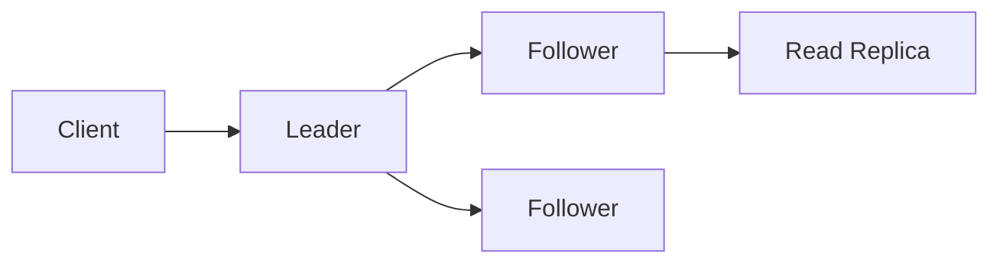

# Follower

Maintaining a consistent state by receiving and persisting data replicated 
from an active leader node within a consensus group.

## What is it?

A follower is one of several peer nodes participating in a distributed 
consensus system, such as those utilizing Raft or Paxos. By default, a 
follower operates passively, accepting commands and log entries only from 
the designated Leader. Its primary responsibility is to ensure data 
durability and consistency by replicating the transaction log maintained 
by the leader. Followers do not propose changes themselves; they merely 
persist the state changes dictated by the majority of the cluster members.

## Why do we need it?

Followers prevent single points of failure (SPOF) in mission-critical 
systems that require continuous availability. When only a single node 
holds data, its failure results in system downtime and data loss. By 
distributing the responsibility across multiple followers, the cluster 
maintains high availability and fault tolerance. This architecture 
guarantees that even if several nodes fail simultaneously, the remaining 
majority can elect a new leader and continue processing requests without 
interruption.

## How does it work?

A follower constantly monitors its communication link to the Leader. The 
process of receiving updates involves the following steps:

1. **Heartbeats:** The designated Leader periodically sends Heartbeat 
messages (or `AppendEntries` RPCs) to all known followers, proving 
continued existence and maintaining the current term number.
2. **Log Replication:** When a client submits a write request, the Leader 
appends it locally and then replicates this entry to the followers using 
dedicated RPC calls.
3. **Validation and Persistence:** Upon receiving an `AppendEntries` 
message, the follower first verifies its term and log index against the 
sender's information. If valid, it commits the entry to local storage 
(disk persistence).
4. **State Machine Application:** Once a majority (quorum) of nodes 
confirm successful persistence, the leader considers the operation 
committed and applies the state change across all replicas.

## Architecture Diagram

## Common Configurations

| Configuration | Description |
| :--- | :--- |
| **Heartbeat Interval** | The time interval (milliseconds) the leader 
uses to send empty heartbeat messages, confirming its presence. |
| **Election Timeout Range** | A range of milliseconds defining how long a 
follower waits without receiving communication before transitioning to a 
Candidate state. |
| **Quorum Size** | The minimum number of nodes (N/2 + 1) required for an 
operation to be considered committed and successful. |
| **Write Consistency Level** | Defines the required acknowledgment level 
(e.g., acknowledging only the leader, or requiring confirmation from the 
quorum). |

## Where is it used?

*   Distributed Key-Value Stores: Ensuring all nodes share the canonical 
copy of data records.
*   Messaging Systems: Persisting transaction logs and ensuring guaranteed 
message delivery order.
*   Configuration Management: Replicating system configuration changes 
across thousands of endpoints simultaneously.
*   Database Replication: Providing read replicas and maintaining strong 
consistency for critical data tables.

## Key Points

*   Followers are always stateless until a log entry is successfully 
committed to the majority quorum.
*   The election process dictates that if communication ceases, a follower 
assumes leadership has failed and initiates an election.
*   Log index verification ensures followers reject conflicting or 
out-of-sync entries from the leader.
*   Commitment means the data is safe on disk across the required minimum 
number of nodes, not just in memory.
*   A quorum must be maintained to elect a new leader or confirm any 
critical write operation.

## Related Components

*   Leader
*   Read Replica
*   Coordinator
*   Lock Service

## Learn More

Quorum
Term
Log Compaction
Idempotency

