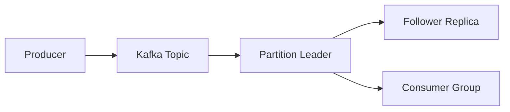

# Kafka

A distributed streaming platform that allows applications to publish and 
subscribe to streams of data in real time. It serves as a high-throughput, 
fault-tolerant messaging backbone for microservices architectures.

## What is it?

Kafka implements a partitioned, immutable commit log replicated across a 
cluster of brokers. Producers write records (messages) to specific topics, 
which are internally segmented into ordered partitions. Consumers read 
these streams by assigning themselves groups and consuming messages 
sequentially from the offset recorded in each partition. This architecture 
treats data not merely as transient messages, but as persistent, r
replayable streams of events, making it foundational for event-driven 
architectures.

## Why do we need it?

Traditional message queues often suffer bottlenecks or lack inherent 
persistence required for complex state management. Kafka solves the 
problem of service coupling and backpressure by decoupling producers from 
consumers asynchronously. It handles extreme throughput requirements by 
distributing data across partitions. When a system requires multiple, 
disparate services to reliably react to streams of events—such as tracking 
user activity or processing financial transactions—Kafka provides the 
necessary backbone for resilience and scalability.

## How does it work?

The workflow involves three main roles: Producers, Brokers, and Consumers.
1. **Production:** A producer client connects to a broker and writes 
records to a specific topic partition. The broker assigns an offset number 
sequentially to the record, ensuring ordered storage within that p
partition.
2. **Replication:** Each partition has multiple replicas across 
different brokers for fault tolerance. When a broker receives a write, it 
replicates the message to its in-sync replicas (ISR).
3. **Consumption:** A consumer group coordinates consumption by assigning 
each active member unique partitions. Consumers poll brokers, retrieving 
records starting from their last committed offset. This process ensures 
that multiple instances of the same service can consume data concurrently 
without processing duplicates.

## Architecture Diagram

## Common Configurations

| Configuration | Description |
| :--- | :--- |
| `replication.factor` | Specifies the number of copies of the partition 
data stored across brokers for redundancy. |
| `min.insync.replicas` | Defines the minimum number of replicas that must 
acknowledge a write before the leader accepts it, ensuring durability. |
| `retention.period` | Sets the maximum time data remains stored in Kafka 
before automatic expiration based on retention policy. |
| `acks` | Determines the acknowledgement level required from brokers 
(e.g., 'all' requires all ISRs to confirm write). |
| `batch.size` | Controls the maximum size of a batch that producers will 
send to improve network efficiency and throughput. |

## Where is it used?

*   **User Activity Tracking:** Ingesting clickstreams, view logs, and 
session events for real-time analytics processing.
*   **Microservice Communications:** Implementing asynchronous messaging 
between independent backend services (e.g., Order Service publishing an 
event consumed by Inventory Service).
*   **Change Data Capture (CDC):** Streaming changes from relational 
databases to downstream data stores or search indices.
*   **Metrics Pipeline:** Collecting, processing, and distributing 
high-volume telemetry and monitoring metrics across a cluster.

## Key Points

*   Data storage is achieved via immutable, ordered partitions.
*   Scaling is horizontal; throughput increases by adding more partitions 
and brokers.
*   Offset management allows consumers to precisely track their read 
position independently of other consumers.
*   The distributed nature inherently provides high fault tolerance 
through replication.
*   It operates as a publish/subscribe system with persistent message 
retention.
*   Supports consumer groups, enabling parallel consumption while 
guaranteeing ordered processing per partition.

## Related Components

*   Message Queue
*   Event Bus
*   Worker

## Learn More

Distributed Logging
Producer-Consumer Pattern
Event Sourcing
CAP Theorem

