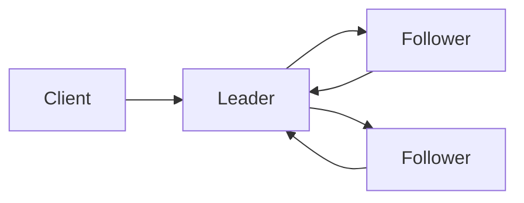

# Leader Election Component

Mechanisms used by a distributed cluster to deterministically select a 
single node responsible for managing shared state or coordinating 
operations.

## What is it?

Leader election is a fundamental synchronization primitive in distributed 
systems that solves the problem of determining which participating member 
should act as the primary coordinator. When multiple nodes need to perform 
an exclusive write operation, only one node must be designated as the 
leader. The component manages the process of achieving consensus on this 
single active participant, ensuring all other non-leader nodes maintain 
awareness of the current operational state and failover procedures. It is 
critical for maintaining data consistency in replicated services.

## Why do we need it?

Distributed systems require consistent coordination to manage shared 
resources. Without a leader election mechanism, multiple nodes could 
independently attempt write operations or modify state simultaneously (the 
"split-brain" scenario), leading to severe data corruption and logical 
inconsistencies. The component ensures atomicity for critical sections of 
code by funneling all primary requests through an agreed-upon single point 
of authority. It activates when any service requires deterministic 
coordination or fault tolerance based on a single source of truth.

## How does it work?

1. A node initiates the election process, becoming a candidate and 
broadcasting its intent to neighboring nodes.
2. Other nodes receiving this request evaluate the candidacy, potentially 
participating in a voting round if they are convinced the current leader 
is unavailable or corrupt.
3. The system enters a consensus phase, where nodes exchange votes to 
determine quorum—a majority agreement of participants—that confirms a 
single node's leadership status.
4. Once a candidate receives sufficient confirmation (the quorum vote), it 
assumes the role of the leader and acquires control over the shared 
resource or write lock.
5. The successful leader then publishes its status, and all followers 
transition into a read-only or standby state until manual intervention or 
failure detection triggers a new election cycle.

## Architecture Diagram

## Common Configurations

| Configuration | Description |
| :--- | :--- |
| `quorum_size` | The minimum number of nodes required to agree on the 
leader's status. |
| `election_timeout` | Duration a node waits before declaring an election 
necessary due to inactivity. |
| `heartbeat_interval` | Frequency with which the active leader reports 
its presence and availability. |
| `vote_period` | The time delay enforced between successive attempts at 
voting in an election cycle. |
| `split_brain_detection` | Mechanism thresholds defining failure 
detection parameters to prevent conflicting leadership claims. |

## Where is it used?

*   Distributed Key-Value Stores (e.g., electing the primary replica).
*   Resource Scheduling Systems (assigning a single scheduler instance for 
coordination).
*   Service Mesh Gateways (determining which gateway instance processes 
incoming traffic).
*   Stateful Workloads (managing leader failover within replicated 
databases or message queues).

## Key Points

*   Leader election relies on fault tolerance mechanisms, often im
implementing time-based retries.
*   The consensus process prevents the "split-brain" scenario by requiring 
majority agreement.
*   Follower nodes should only execute writes upon explicit confirmation 
of leadership status.
*   High availability requires multiple redundant services dedicated 
solely to managing consensus state.
*   Election overhead increases with cluster size, necessitating efficient 
voting protocols.

## Related Components

*   Follower
*   Coordinator
*   Lock Service

## Learn More

Idempotency
Quorum Consensus
Total Ordering

