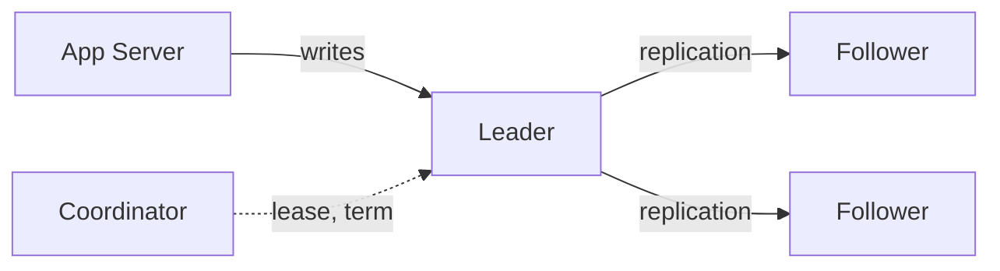

# Leader

The one node in a replicated group currently allowed to accept writes. Leader
is a role, not a machine: it moves to another node when the current holder
fails.

## What is it?

In a replicated store, every node holds a copy of the data but only one may
accept writes at a time. That node is the **leader**; the others are
**followers**, which replicate from it and may serve reads. The leader orders
every write, sends it to the followers, and acknowledges it to the client once
enough copies have it.

The role is held on a lease and stamped with a **term** number. When the leader
stops renewing, a new one is elected for a higher term, and nodes refuse
anything from an older term.

## Why do we need it?

Two nodes accepting writes to the same data at the same time produce two
histories that cannot be merged safely afterwards: split brain. A single leader
makes the order of writes unambiguous.

The hard part is not having a leader but replacing one. A leader that is
unreachable looks exactly like a leader that is dead, so the decision to move
the role cannot be made by the nodes involved. It is made by majority, through
a coordinator group or a consensus protocol among the nodes themselves.

## How does it work?

1. The leader accepts a write, appends it to its log, and replicates it to the
   followers.
2. With majority acknowledgement, the write is confirmed once the leader and
   enough followers have it, so no confirmed write is lost on failover.
   With asynchronous replication, the last few hundred milliseconds can be.
3. The leader keeps renewing its lease. If it stops, followers wait out the
   election timeout, then a majority elects the follower with the most recent
   data as leader for the next term.
4. When the old leader returns, its term is stale. Its writes are refused and
   it rejoins as a follower.

## Architecture Diagram

```mermaid
graph LR
    A[App Server] -->|writes| L[Leader]
    L -->|replication| F1[Follower]
    L -->|replication| F2[Follower]
    C[Coordinator] -.->|lease, term| L
```

## Common Configurations

| Configuration | Description |
| :--- | :--- |
| **Election Timeout Ms** | How long followers wait without hearing from the leader before electing a new one. Short timeouts fail over fast but trigger needless elections on a GC pause or network blip; long ones mean seconds of refused writes on every real failure. |

## Where is it used?

*   Replicated databases: one primary, automatic failover (3.26).
*   Coordinator groups themselves: Raft and ZAB each elect a leader internally.
*   Partitioned stores and logs: every shard or partition has its own leader.

## Key Points

*   Exactly one leader per group at a time; more than one is split brain.
*   Leadership is a lease plus a term: the lease bounds how long a dead leader
    blocks writes, the term fences one that comes back.
*   Elections need a majority, so a group of 3 survives one failure and 5
    survive two.
*   Whether failover loses writes depends on how writes are acknowledged, not
    on the election.

## Related Components

*   Follower
*   Coordinator
*   Read Replica

## Learn More

Raft
Split Brain
Quorum
Fencing Tokens
