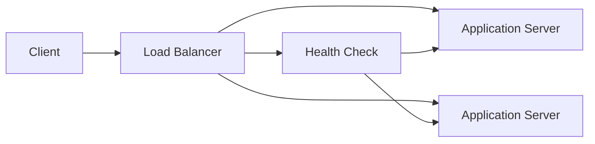

# Load Balancer

Distributes incoming network traffic across a group of backend servers or 
resources, ensuring no single point of failure and optimizing resource 
utilization.

## What is it?

A load balancer acts as a highly available entry point that sits between 
clients and a group of application servers. Its primary function is to 
distribute client requests evenly among the configured backends, p
preventing any server from becoming a bottleneck (hot spot). Load 
balancers operate at various layers of the OSI model (L4 or L7) and 
utilize sophisticated algorithms—such as round-robin or least conn
connections—to decide which backend receives the next request. They are 
critical components in scaling applications horizontally across multiple 
instances.

## Why do we need it?

Scaling stateless services horizontally requires a mechanism to distribute 
traffic efficiently and maintain high availability. Without a load 
balancer, client requests would typically target a single IP address, 
overloading that server as traffic increases. Load balancers solve this by 
providing abstraction over the backend pool. Furthermore, they enable 
health checking, automatically detecting failed servers and removing them 
from rotation, thereby maintaining service uptime even during hardware 
failures or deployment issues.

## How does it work?

The process begins when a client sends an incoming request to the load 
balancer's public IP address. The load balancer intercepts this traffic, 
performs initial checks (like SSL termination if L7), and validates the 
health of all registered backend nodes through configured health checks. 
It then selects a suitable backend server based on its chosen algorithm 
(e.g., weight distribution or lowest active connections). Finally, the 
load balancer forwards the request to the chosen healthy server, routes 
the response back to the client, and manages session persistence if 
required by the application state.

## Architecture Diagram

## Common Configurations

| Configuration | Description |
| :--- | :--- |
| **Algorithm: Round Robin** | Distributes traffic sequentially to each 
backend in a rotating fashion. |
| **Algorithm: Least Connections** | Directs traffic to the server 
currently handling the fewest active connections. |
| **Health Checks** | Periodic probes (HTTP/TCP) to verify the operational 
status of backend endpoints. |
| **Session Stickiness** | Ensures subsequent requests from a client are 
routed back to the same original backend server. |
| **Load Balancing Layer 4** | Operates at the Transport layer (TCP/UDP), 
distributing based on IP and port without inspecting payloads. |

## Where is it used?

*   API Gateway implementations serving microservices.
*   Web applications requiring high traffic capacity during peak hours.
*   Stateful services that require session persistence across multiple 
nodes.
*   Distributed database clusters accessing read replicas for scale.

## Key Points

*   Handles termination of network protocols (SSL/TLS).
*   Provides a single, stable entry point IP address regardless of backend 
scaling changes.
*   Determines traffic distribution based on configurable algorithms and 
weights.
*   Crucial mechanism for achieving horizontal scalability and resilience.
*   Manages failover by dynamically removing unhealthy backends from the 
rotation.

## Related Components

*   Reverse Proxy
*   Application Server
*   API Gateway
*   DNS

## Learn More

Traffic Shaping
Network Topology
Session Management
Connection Pooling

