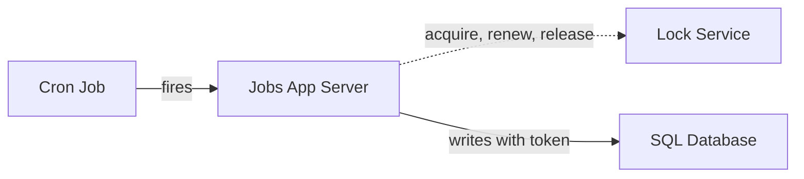

# Lock Service

Grants a named lock to one holder at a time across machines, as a lease that
frees itself if the holder dies.

## What is it?

A mutex only works inside one process. Across machines there is no shared
memory to hold one, so a **lock service** keeps the lock instead: callers ask
it for a named lock, at most one gets it, and it is released when the holder
finishes or stops renewing.

It is built on a consensus group so that losing one of its machines neither
loses the lock nor lets two callers believe they hold it. ZooKeeper, etcd and
Google's Chubby are the usual implementations.

## Why do we need it?

Some work must never run twice at once: an hourly sweep that sometimes takes
longer than an hour, a nightly close on a pool of three instances, a migration
step. A flag in one process's memory does not help, because the second run is
on another machine.

The lock service gives every machine one place to ask "may I?", and its lease
makes sure a crashed holder cannot block the work forever.

## How does it work?

1. **Acquire.** A caller asks for a named lock (`expiry-sweep`). If it is free,
   the service grants it with a lease (say 30 seconds) and a **fencing token**,
   an increasing number.
2. **Renew.** The holder renews the lease while it works, for example every 10
   seconds. A 70-minute job on a 30-second lease is fine as long as it keeps
   renewing.
3. **Release or expire.** The holder releases the lock when done. If it crashes
   it stops renewing, and the lease expires on its own.
4. **Fence.** A holder paused longer than its lease (a long GC pause) can wake
   up still writing after someone else has the lock. Every write carries its
   token, and the data store refuses tokens older than one it has already seen.

## Architecture Diagram

The service that does the work asks for the lock. The scheduler only fires.

## Common Configurations

| Configuration | Description |
| :--- | :--- |
| **Lock Ttl Seconds** | How long a lock survives without renewal. It bounds how long a dead holder blocks the next run, not how long the job may take. |

## Where is it used?

*   **Scheduled jobs:** one run of a sweep or report at a time (3.23).
*   **Leader-style work for a single task:** one instance runs a background loop
    while the others stand by.
*   **Coarse, rare decisions:** a migration step, a cluster-wide config change.

## Key Points

*   A lock is a lease: it must expire, and the holder must renew it.
*   Without fencing tokens, a paused holder is a second holder.
*   Keep it off the request path: every acquire is a consensus round trip.
*   Use it for coarse, infrequent decisions, not per-request mutual exclusion.

## Related Components

*   Coordinator
*   Cron Job
*   Application Server

## Learn More

Leases
Fencing Tokens
Mutual Exclusion
Consensus
