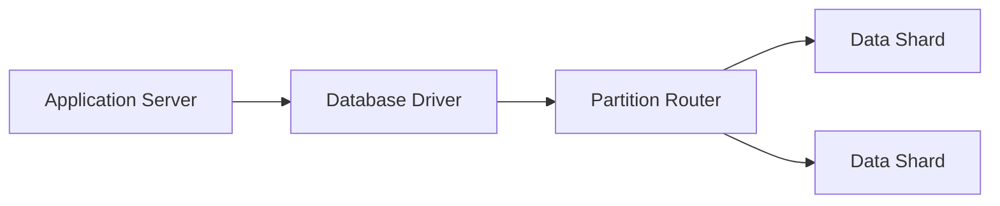

# NoSQL Database

Provides flexible data storage optimized for high volume, rapid read/write 
operations, and horizontal scalability across distributed nodes.

## What is it?

A class of databases designed to store and retrieve unstructured or 
semi-structured data, differing significantly from traditional relational 
systems. Instead of enforcing a strict schema, NoSQL databases allow 
developers to define schemas at the application level. This flexibility 
enables rapid iteration and adaptation to evolving data models without 
requiring costly migrations. They typically partition data across multiple 
machines (sharding) to distribute load and ensure high availability under 
extreme traffic loads.

## Why do we need it?

Relational databases enforce rigid schema constraints, which impedes 
agility when faced with diverse or rapidly changing datasets. NoSQL solves 
the scalability bottleneck that occurs when relational systems struggle to 
scale writes linearly across thousands of nodes. Furthermore, for 
applications dealing with complex relationships (e.g., social graphs) or 
multimedia data payloads (JSON documents), using a single tabular model is 
inefficient. Choosing NoSQL addresses both schema flexibility and 
horizontal scaling requirements simultaneously.

## How does it work?

The operation flow depends on the specific type (Key-Value, Document, 
Graph), but generally involves direct mapping of an identifier to a blob 
of content.

1.  **Client Request:** The application sends a request containing a 
unique key and optional payload data structure to the database cluster 
entry point.
2.  **Routing Layer:** The cluster's routing mechanism intercepts the 
request and uses a consistent hashing algorithm based on the provided key. 
This determines which specific physical node (shard) is responsible for 
storing that piece of data.
3.  **Write Operation:** If writing, the designated node receives the 
data, validates its structure if applicable, and persists the record to 
its local storage while maintaining replication copies across peer nodes 
for redundancy.
4.  **Read Operation:** The read request follows steps 1 and 2, directing 
the query only to the specific shard expected to hold the key. This 
targeted retrieval minimizes network hops and maximizes read throughput.

## Architecture Diagram

## Common Configurations

| Configuration | Description |
| :--- | :--- |
| **Replication Factor** | The number of copies maintained for every data 
shard to ensure availability upon node failure. |
| **Write Concern** | Defines the level of acknowledgment required (e.g., 
majority, all nodes) before a write operation is considered successful. |
| **Consistency Model** | Specifies the trade-off between eventual 
consistency and strong consistency across replicas (e.g., CAP theorem 
choice). |
| **Sharding Key** | The specific field or attribute used by the database 
to determine data partitioning across multiple physical nodes. |
| **TTL (Time To Live)** | Defines a lifecycle policy automatically 
deleting records after they exceed a set time duration. |

## Where is it used?

*   High-traffic session management and user profile storage (Key-Value).
*   Content Management Systems storing varied payloads like articles or 
blog posts (Document).
*   Social networking applications for modeling friendships, followers, 
and connections (Graph).
*   IoT device data ingestion pipelines handling massive, high-velocity 
streams of unstructured telemetry data.

## Key Points

*   Scalability is achieved through horizontal partitioning (sharding) 
rather than vertical scaling.
*   Flexibility in schema allows rapid development cycles for evolving 
product features.
*   Data consistency trade-offs must be carefully modeled alongside 
availability requirements.
*   Queries often rely heavily on the primary key or indexed fields; 
complex joins are generally discouraged.
*   Optimizes for high read/write throughput, making it suitable for 
write-heavy workloads.
*   The absence of ACID guarantees across all operations requires 
application-level data integrity checks.

## Related Components

*   Cache
*   Message Queue
*   Application Server

## Learn More

CAP Theorem
Consistent Hashing
Eventually Consistent
Sharding Strategy

