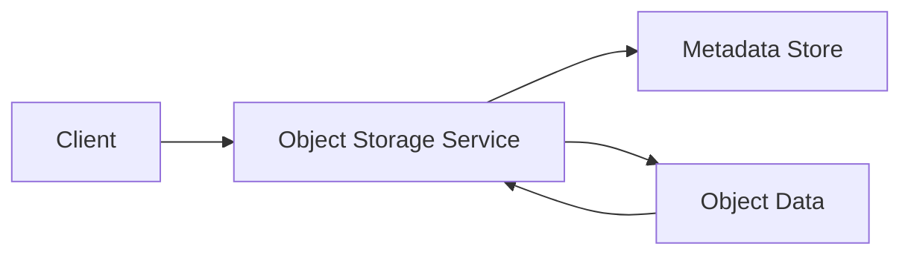

# Object Storage

Stores large volumes of unstructured data objects (blobs) accessed via 
defined APIs and managed through hierarchical key structures.

## What is it?

Object storage provides a highly scalable mechanism for storing massive 
amounts of diverse data—including media, archives, backups, and da
datasets—as discrete objects. Unlike file systems which impose directory 
hierarchies and block stores optimized for structured volume attachment, 
object storage treats every unit of data as an opaque blob identified by a 
unique key (or path). It exposes mechanisms for metadata management and 
content addressing but does not manage the internal structure of the 
stored content itself. This paradigm allows platforms to scale capacity 
independently of compute resources, supporting petabytes of rapidly 
changing data with minimal operational overhead.

## Why do we need it?

Traditional storage architectures face scalability and cost limitations 
when confronted with exabyte-scale, unstructured datasets typical in 
modern applications (e.g., IoT sensor data or user generated media). 
Implementing global file system consistency at planetary scale introduces 
significant latency and complexity bottlenecks. Object storage solves this 
by adopting a shared-nothing architecture that inherently supports massive 
horizontal scaling and provides built-in mechanisms for geographical 
replication. It decouples the data payload from the processing env
environment, making it ideal for data lakes and content backends requiring 
extreme durability and high availability without rigid schema enforcement.

## How does it work?

The object storage service exposes a set of RESTful APIs (e.g., PUT 
object, GET object). When a client wishes to store data, they make an HTTP 
PUT request containing the binary payload and specifying the unique key 
path for the object. The API gateway accepts this request, validates the 
access credentials, and forwards the data chunk to the underlying 
distributed storage cluster.

1.  The Object Storage service generates or uses the supplied unique 
identifier (the key) and stores associated metadata (e.g., content type, 
creation date).
2.  The payload is partitioned and replicated across multiple physical 
nodes within the cluster for durability.
3.  For retrieval, a client sends an HTTP GET request with the object's 
full key path. The service routes the request to the nearest available 
replica node and returns the binary data stream. Write operations often 
operate under eventual consistency models, guaranteeing eventual p
propagation of changes across all regions.

## Architecture Diagram

## Common Configurations

| Configuration | Description |
| :--- | :--- |
| **Storage Class** | Defines the retrieval frequency and required 
durability (e.g., Hot, Cold, Archive). Impacts cost structure. |
| **Bucket Replication Policy** | Specifies how many geographical regions 
must receive a copy of the object to ensure high availability. |
| **Access Control List (ACL)** | Granular rules defining which users or 
service identities can perform actions (Read/Write) on specific objects or 
containers. |
| **Lifecycle Rules** | Automates data movement and deletion over time 
(e.g., transition objects older than 90 days from Hot to Cold storage). |
| **Versioning** | Maintains multiple historical copies of an object, 
allowing recovery from accidental overwrites or deletions. |

## Where is it used?

*   **Media Hosting:** Storing user-generated content, videos, and images 
for streaming services.
*   **Data Lake Backends:** Serving as the underlying persistent layer for 
massive analytical datasets (e.g., Parquet, ORC files).
*   **Backup and Disaster Recovery:** Archiving system snapshots or 
database backups due to low operational cost per GB stored.
*   **Static Asset Delivery:** Hosting immutable website assets (J
(JavaScript bundles, CSS files) served via a Content Delivery Network.

## Key Points

*   Data is addressed by opaque keys, eliminating the need for complex 
file paths or directory structures.
*   The architecture naturally supports global distribution and mu
multi-region replication.
*   Immutability is frequently managed through versioning capabilities at 
the bucket level.
*   Operations are fundamentally exposed as API calls (PUT/GET) over HTTP 
protocols.
*   Consistency models can range from eventual consistency to immediate 
consistency, depending on configuration needs.

## Related Components

*   CDN
*   Serverless Function
*   Application Server

## Learn More

Data Lakes
S3 API Compatibility
Bloom Filters
Eventual Consistency

