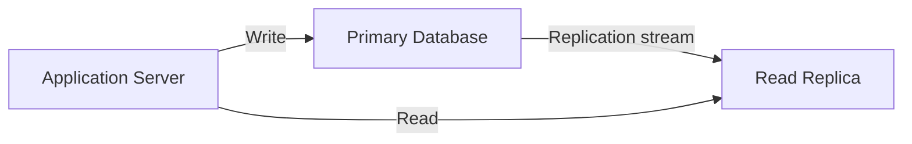

# Read Replica

A copy of a primary database instance, optimized for read operations to 
offload traffic from the main write source.

## What is it?

A read replica is an auxiliary database server that maintains synchronized 
data with the primary (or master) database instance. It operates primarily 
as a consumption endpoint, receiving replicated writes and reads designed 
specifically to scale data retrieval capacity. Engineers utilize replicas 
when the read load significantly exceeds the write load on the core system 
database. Replicas provide geographic proximity options and fault 
isolation while ensuring eventual consistency with the source of truth.

## Why do we need it?

As applications scale, the volume of read queries often far surpasses 
writes (the "read-heavy" workload). If all traffic hits a single primary 
node, the transactional throughput and latency will suffer, necessitating 
resource scaling that can be expensive or technically complex. Read 
replicas solve this by distributing query load across multiple nodes, 
preventing performance bottlenecks on the main write database and 
improving overall system availability during high traffic periods.

## How does it work?

The replication process involves continuous data synchronization from the 
primary source to the replica. This typically happens using a binlog or 
transaction log mechanism (e.g., Write-Ahead Logs).
1. The application performs a write operation on the Primary Database, 
committing the transaction and recording the changes in its persistent 
transaction log.
2. A dedicated replication service reads these committed logs asyn
asynchronously from the Primary.
3. The replication service parses the change records and applies them 
sequentially to the Read Replica instance.
4. The Read Replica accepts direct read queries from client applications, 
querying its local copy of the data set.

## Architecture Diagram

## Common Configurations

| Configuration | Description |
| :--- | :--- |
| **Asynchronous Replication** | The replica reads changes after they are 
committed to the primary, providing eventual consistency. Lowest latency 
overhead. |
| **Semi-Synchronous Replication** | The write must be logged by at least 
one replica before acknowledging commit to the client, balancing safety 
and performance. |
| **Master-to-Multiple Read Replicas** | A single primary replicates data 
simultaneously to several read replicas for maximum horizontal scaling of 
reads. |
| **Cross-Region Replication** | Establishing a read replica in a 
geographically distinct region to serve local traffic with low latency and 
disaster recovery capability. |

## Where is it used?

* High-traffic content delivery platforms (e.g., reading user profiles, 
viewing cached articles).
* E-commerce catalog browsing systems that experience massive read spikes 
before transactions occur.
* Analytics dashboards querying historical data without impacting live 
transaction processing.
* IoT telemetry ingestion points that require high throughput for 
sequential reads.

## Key Points

* **Write Flow:** All write operations must always target the Primary 
instance to maintain a single source of truth.
* **Consistency Model:** Read replicas typically operate under eventual 
consistency; immediate read-after-write might fail on some instances.
* **Load Distribution:** Scaling capacity is achieved by distributing 
query load across multiple read nodes, rather than increasing single node 
write throughput.
* **Failover Target:** Replicas can be promoted to primary roles only if 
the original master fails and no other primary exists.
* **Operational Overhead:** Requires continuous monitoring of replication 
lag and network bandwidth utilization between nodes.

## Related Components

Database Cluster
Primary Database
Data Synchronization Service

## Learn More

CAP Theorem
Eventual Consistency
Replication Lag
Write-Ahead Logging (WAL)
