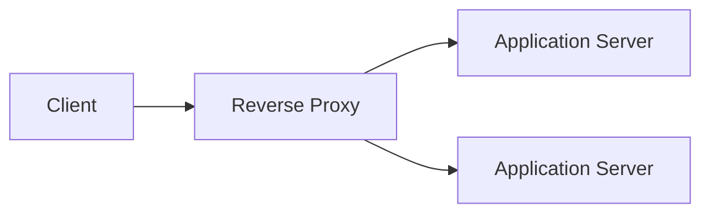

# Reverse Proxy

A server that forwards client requests to specific backend servers, 
abstracting the client from the internal infrastructure topology.

## What is it?

A reverse proxy acts as an intermediary point between external clients and 
one or more backend services. Instead of connecting directly to a 
service's endpoint, the client connects to the proxy. The proxy intercepts 
incoming HTTP/HTTPS requests and routes them based on predefined r
rules—such as URL path or hostname—to the appropriate internal server 
cluster. This mechanism shields the backend architecture from direct 
external exposure, providing an essential layer of network abstraction and 
routing logic within a modern distributed system.

## Why do we need it?

A reverse proxy solves the complexity inherent in microservice arc
architectures where clients interact with numerous services exposed at 
different ports or paths. It centralizes entry points, allowing operators 
to manage multiple services under a single domain name without requiring 
client reconfiguration. Furthermore, proxies enforce crucial cross-cutting 
concerns like rate limiting, SSL termination, and TLS inspection before 
traffic reaches potentially vulnerable backend components.

## How does it work?

1. The client sends an incoming request (e.g., `api.example.com/v1/users`) 
to the reverse proxy's public IP address and port 80/443.
2. The proxy receives the request, performs necessary tasks such as SSL 
termination and header modification, and inspects the host or URI path.
3. Based on its configuration rules (e.g., if the path starts with 
`/v1/`), the proxy determines the correct upstream destination IP address 
and port.
4. The proxy then initiates a new connection to the backend service's 
internal network endpoint.
5. Finally, the proxy forwards the request data, receiving the response 
from the backend, and transmits the response back to the original client.

## Architecture Diagram

## Common Configurations

| Configuration | Description |
| :--- | :--- |
| `listen_ports` | Defines the external ports (e.g., 80, 443) the proxy 
accepts traffic on. |
| `upstream_group` | Maps a hostname or URI path to a pool of backend IP 
addresses/ports. |
| `rate_limiting` | Applies request limits (e.g., X requests per minute) 
globally or per endpoint. |
| `tls_certificate` | Specifies the cryptographic certificate and key used 
for SSL termination. |
| `request_headers` | Overrides or injects headers (e.g., `X-Forwa
`X-Forwarded-For`) before sending to backends. |

## Where is it used?

*   **API Gateways:** Centralizing external access to internal mic
microservice APIs, handling authentication and rate limiting universally.
*   **Web Hosting:** Serving static assets or routing requests for 
multiple distinct websites from a single IP address.
*   **Edge Computing:** Providing initial ingress points that terminate 
TLS connections close to the end user to reduce latency.

## Key Points

*   Operates at Layer 4 (TCP) or Layer 7 (HTTP/HTTPS).
*   Decouples the client interface from the backend implementation 
details.
*   Manages cross-cutting concerns like load balancing and caching 
efficiently.
*   Requires careful management of internal network address visibility.
*   Must handle connection pooling to prevent resource exhaustion on 
backends.

## Related Components

*   Load Balancer
*   API Gateway
*   Application Server

## Learn More

HTTP Headers
SSL Termination
Client IP Tracking

