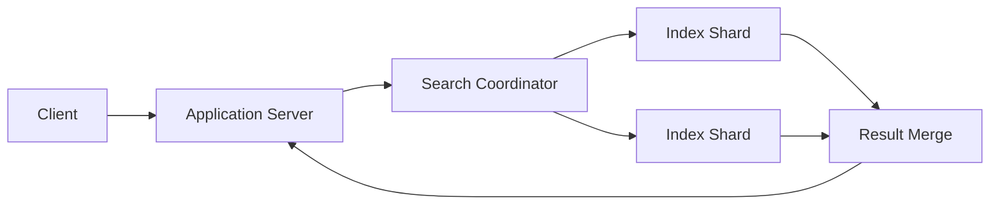

# Search Engine

Enables fast, scalable full-text searching and retrieval over massive 
datasets of structured and semi-structured documents.

## What is it?

A search engine is a complex application designed to efficiently store, 
index, and query large volumes of textual data. Unlike traditional 
databases that prioritize transactional integrity for records, a search 
engine focuses on rapid information retrieval across indexes built from 
documents. It processes document content through tokenization and analysis 
pipelines to create an inverted index—a mapping from indexed terms 
(tokens) back to the documents containing them. This structure allows 
complex Boolean queries and relevance scoring without full table scans.

## Why do we need it?

Relational databases are optimized for structured querying and ACID 
properties, but performance degrades significantly when executing 
large-scale text matching or fuzzy searches across billions of records. A 
search engine solves this bottleneck by decoupling the indexing process 
from transactional storage. It handles high query throughput requirements 
and provides advanced capabilities like stemming, synonym resolution, typo 
tolerance, and faceted search filtering that are essential for modern user 
interfaces searching large content repositories.

## How does it work?

The system operates through two primary phases: ingestion (indexing) and 
querying. During indexing, documents pass through an analyzer which 
tokenizes the text (breaking it into words), normalizes it (e.g., 
lowercasing), and applies filters (like stemming or stopword removal). 
These analyzed tokens are then stored in an inverted index mapping tokens 
to document IDs and positions.

When a query arrives, the search engine first analyzes the query terms 
using the same pipeline. It then looks up these terms in the inverted 
index to retrieve a set of matching Document IDs. Finally, it executes a 
scoring algorithm (e.g., TF-IDF or BM25) to calculate relevance for each 
document based on how frequently and prominently the query terms appear 
within that specific document's indexed content.

## Architecture Diagram

## Common Configurations

| Configuration | Description |
| :--- | :--- |
| **Sharding Count** | The number of independent partitions the index is 
split into, distributing data load and improving scalability. |
| **Replication Factor** | Determines how many copies of each shard exist 
for fault tolerance and read scaling. |
| **Index Mapping** | Defines the specific field types (e.g., text, 
integer, geo) and analyzers applied to ingested documents. |
| **Analyzers/Tokenizers** | Specifies pre-processing rules—such as 
stemming or stopword removal—applied to raw input text during indexing. |
| **Time-to-Live (TTL)** | Defines the automatic expiration policy for 
indexed data segments, managing index growth and resource consumption. |

## Where is it used?

*   **E-commerce Platforms:** Product catalog searching with filtering 
(facets), relevance sorting, and typo correction.
*   **Content Management Systems (CMS):** Implementing sitewide search for 
articles, documentation, and user-generated content.
*   **Log Aggregation:** Indexing large volumes of structured logs for 
rapid debugging and incident investigation.
*   **Knowledge Bases:** Providing deep search capabilities over corporate 
or academic documents requiring sophisticated semantic matching.

## Key Points

*   It operates on an inverted index structure, reversing the relationship 
between records and terms.
*   Relevance scoring is crucial; it determines the ranking order of 
results based on term frequency and inverse document frequency.
*   Indexing is a separate process from querying, allowing background 
updates without impacting read latency.
*   Scalability relies heavily on sharding data across multiple in
independent nodes (clusters).
*   Typo tolerance and natural language processing (NLP) capabilities 
enhance the precision of query matching.

## Related Components

*   SQL Database
*   Message Queue
*   Cache

## Learn More

Inverted Indexing
TF-IDF Scoring
Tokenization
Sharding
Relevance Ranking

