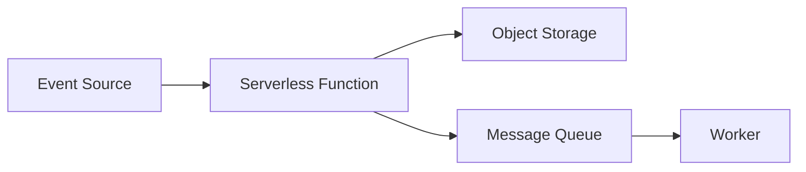

# Serverless Function

Executes ephemeral compute logic in response to events without pro
provisioning or managing underlying infrastructure resources.

## What is it?

A serverless function executes discrete, stateless units of code only when 
triggered by a specific event source. The execution environment manages 
the runtime lifecycle, including allocation and deallocation of computing 
resources. Developers upload the business logic code and define dependency 
packages, abstracting away operating system patches, scaling rules, and 
resource management overhead. This model allows immediate functional 
implementation while optimizing operational complexity.

## Why do we need it?

Traditional compute services require provisioning minimum capacity, 
leading to idle resources and associated costs during periods of low 
traffic. Serverless functions solve the problem of automatic, near
near-instantaneous scaling and precise billing models. They are necessary 
for event-driven workloads where invocation rates fluctuate dramatically, 
such as image processing queues or webhook handling, ensuring cost 
efficiency and resilience against unexpected load spikes.

## How does it work?

The execution flow begins when a trigger source—such as an HTTP request, 
message queue entry, or file upload to object storage—generates an event. 
The Serverless Platform detects this event and invokes the corresponding 
function handler.

1.  **Event Detection:** The platform monitors configured triggers (e.g., 
SNS topic, S3 bucket).
2.  **Cold Start/Warm Pool Check:** If no instance is active, a "cold 
start" occurs; the runtime environment provisions and initializes the code 
container. If an instance exists, it handles the request immediately 
("warm pool").
3.  **Execution:** The platform executes the function payload with the 
event data as input parameters.
4.  **Result Handling:** Upon completion or failure, the function returns 
a result or error status.
5.  **Scaling/Teardown:** If load increases, new instances are provisioned 
quickly to meet demand; if inactive, the container is eventually torn down 
by the platform.

## Architecture Diagram

## Common Configurations

| Configuration | Description |
| :--- | :--- |
| **Time Limit** | Maximum execution time allowed for the function 
invocation (e.g., 30 seconds). |
| **Memory Allocation** | Amount of RAM assigned to the container, which 
often dictates CPU power available. |
| **Trigger Source Mapping** | Defines which specific events (e.g., object 
type, queue depth) initiate execution. |
| **Concurrency Limit** | Sets a hard cap on the number of simultaneous 
instances that can run from this function. |
| **VPC Integration** | Specifies network boundary requirements, forcing 
the function to operate within a private subnet. |

## Where is it used?

*   Processing file uploads (e.g., resizing images after upload to object 
storage).
*   Handling API webhooks and routing external service calls.
*   Implementing scheduled batch jobs triggered by time intervals 
(cron-like tasks).
*   Responding directly to database changes or stream messages in a data 
pipeline.

## Key Points

*   Function execution is inherently stateless; state must be managed 
externally (e.g., databases, persistent stores).
*   Scaling mechanisms are automated and horizontal, scaling from zero up 
to thousands of instances.
*   Billing models typically charge based on invocation count and compute 
duration ($\text{ms}$).
*   Cold starts introduce potential latency due to runtime initialization 
overhead.
*   The function receives an event payload that encapsulates all necessary 
execution context.
*   Execution environments isolate the compute unit, providing high levels 
of sandboxing security.

## Related Components

*   Object Storage
*   Message Queue
*   API Gateway
*   SQL Database

## Learn More

Event-Driven Architecture
Idempotency
Cold Start Latency
Invocations vs. Transactions

