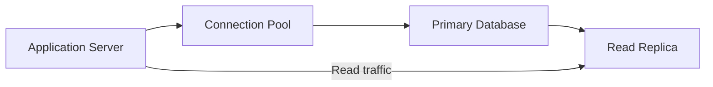

# SQL Database

A structured data management system that organizes data into predefined 
tables, enforcing relationships and transactional integrity via schemas.

## What is it?

The relational database model structures information using tables composed 
of rows and columns. It defines explicit schemas that enforce data types 
and constraints, ensuring data consistency across the dataset. Operations 
are conducted through Structured Query Language (SQL), which allows users 
to define complex retrieval, insertion, modification, and deletion logic. 
SQL databases prioritize adherence to ACID principles—Atomicity, C
Consistency, Isolation, and Durability—making them suitable for managing 
mission-critical data where transactional integrity is non-negotiable.

## Why do we need it?

Relational databases solve the problem of maintaining complex state 
consistency within an application's backend. They are required when 
multiple business rules must interact with shared data simultaneously 
(e.g., debiting one account while crediting another). When eventual 
consistency risks data corruption, or when strict adherence to established 
foreign key constraints is mandatory, an SQL database provides the 
necessary transactional guarantees. It acts as the single source of truth 
for core application state.

## How does it work?

The system manages data through a client-server architecture. The workflow 
typically follows these steps:

1.  **Connection:** An application service establishes a connection to the 
Database Connector, usually via a pool manager to optimize resource use.
2.  **Query Submission:** The service submits an SQL query (e.g., 
`SELECT`, `INSERT`, `UPDATE`) specifying desired data operations or 
retrieval parameters.
3.  **Processing:** The database engine receives the query and the Query 
Optimizer analyzes the required resources, determining the most efficient 
execution plan based on existing indexes.
4.  **Execution:** The Transaction Manager coordinates the request, 
enforcing isolation levels (e.g., Read Committed). Data modification 
queries are wrapped in transactions to ensure atomicity.
5.  **Result Set/Commit:** Upon successful execution, the database commits 
the transaction to persistent storage and returns a result set or an 
acknowledgment status back through the connection pool to the originating 
service.

## Architecture Diagram

## Common Configurations

| Configuration | Description |
| :--- | :--- |
| **Replication Strategy** | Defines how write operations are synchronized 
across multiple nodes (e.g., Master-Slave, Multi-Master). |
| **Transaction Isolation Level** | Controls how transactions running 
concurrently interact and affect each other's visibility (e.g., Se
Serializable, Read Committed). |
| **Connection Pool Size** | The maximum number of open connections the 
application service maintains to prevent resource exhaustion. |
| **Indexing Depth/Type** | Specifies metadata structures used by the 
engine to accelerate query lookup times on specific columns or groups of 
columns. |
| **Backup Retention Policy** | Determines how long historical snapshots 
of the dataset are maintained for recovery and point-in-time restoration. 
|

## Where is it used?

*   Financial transaction processing (ledger accounting, debit/credit 
operations).
*   E-commerce shopping carts and order management systems where data 
consistency is critical.
*   User authentication and identity services requiring strict user 
profile integrity.
*   Inventory management platforms tracking stock levels and transactions 
in real time.
*   HR management systems storing employee records subject to complex 
relationship rules.

## Key Points

*   Transactions group multiple related SQL statements into a single, 
indivisible unit of work.
*   Schema changes (migrations) require careful coordination across all 
services that consume the data structure.
*   Read replicas offload read traffic from the primary write node, 
improving horizontal scalability for reads.
*   The necessity of an indexing strategy is paramount for maintaining 
acceptable query latency at scale.
*   Optimizing complex joins and stored procedures is often required to 
improve database throughput bottlenecks.
*   Write contention frequently dictates the effective scaling limits of a 
relational database deployment.

## Related Components

*   Cache
*   Read Replica
*   Message Queue

## Learn More

ACID Properties
Transaction Isolation Levels
Indexing Theory
Joins and Normalization
CAP Theorem

