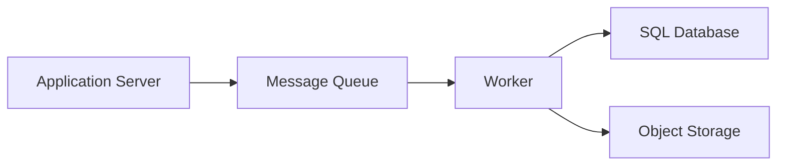

# Worker

A dedicated process component responsible for consuming messages or 
executing asynchronous tasks delegated by other system services.

## What is it?

Workers execute non-realtime background computation units necessary for 
maintaining system state and processing delayed events. They operate 
independently of the core request path, retrieving work items from a 
defined source queue or stream. The worker implementation contains the 
business logic required to process the payload data and interact with 
downstream services (like databases or external APIs). Scaling workers 
typically involves adjusting the pool size based on incoming message 
throughput requirements.

## Why do we need it?

Workers decouple long-running, compute-intensive tasks from user-facing 
API calls. Executing heavy operations synchronously degrades service 
latency and reduces user experience quality. Without a worker component, 
systems would block threads waiting for external resource availability or 
complex computations to finish. Workers enable horizontal scaling of 
processing capacity and manage transient failures gracefully by employing 
retry mechanisms.

## How does it work?

The Worker executes an asynchronous processing loop initiated through 
subscribing to a message queue. The workflow generally follows these 
steps:

1.  **Consumption:** The worker polls the Message Broker, receiving one or 
more messages (tasks) from a topic or queue.
2.  **Deserialization:** The worker deserializes the raw payload into 
structured data types and validates the input schema.
3.  **Execution:** The core business logic executes, performing co
computation, coordinating database writes, or calling external services 
using the received task context.
4.  **Acknowledgement/Failure:** If execution completes successfully, the 
worker sends an acknowledgment (ACK) message to the broker, removing the 
item from the queue. If processing fails, the worker handles retries; 
after exhausting retries, it may send the message to a Dead Letter Queue 
(DLQ).

## Architecture Diagram

## Common Configurations

| Configuration | Description |
| :--- | :--- |
| `concurrency_limit` | Maximum number of tasks the worker can process 
simultaneously. |
| `retry_count` | The maximum number of times a failed task will be 
re-processed before failing permanently. |
| `queue_timeout_seconds` | Duration to wait for messages; determines how 
often polling occurs if no work is available. |
| `batch_size` | Number of tasks the worker attempts to consume and 
process in one poll cycle. |
| `visibility_ttl_seconds` | Time a message remains locked after c
consumption, protecting it from simultaneous processing by other workers. 
|

## Where is it used?

*   **Image Processing:** Resizing, cropping, or applying filters to 
uploaded assets upon file ingestion.
*   **Email Notification Sending:** Dispatching high-volume transactional 
emails asynchronously after user actions (e.g., registration).
*   **Data Synchronization:** Running periodic batch jobs that reconcile 
data between internal services and external CRM systems.
*   **Video Transcoding:** Handling large media files by executing complex 
encoding pipelines outside the main request flow.

## Key Points

*   Workers must ensure processing logic is idempotent to handle g
guaranteed delivery retries safely.
*   The worker component shields synchronous APIs from time-consuming 
backend operations.
*   Failure handling relies heavily on dead letter queues (DLQs) for 
monitoring failure modes.
*   High message throughput demands tuning of batch size and concurrency 
limits.
*   Workers consume messages in a decoupled manner, providing resilience 
against service dependency outages.

## Related Components

*   Message Queue
*   Dead Letter Queue
*   Application Server

## Learn More

Idempotency
At Least Once Delivery
Backpressure
Dead Letter Queue

