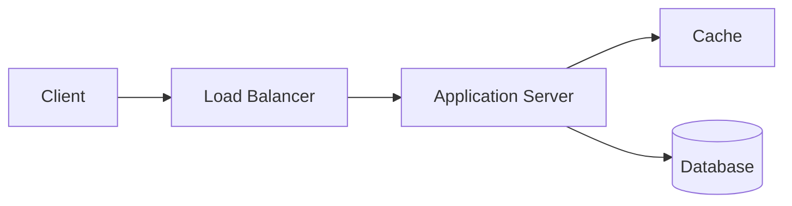

# Application Server

> Executes your application's business logic and processes incoming requests.

---

## What is it?

An application server hosts your backend application. It receives requests, executes business logic, communicates with other services such as databases and caches, and returns a response to the client.

---

## Why do we need it?

Application servers keep business logic separate from clients and databases. They handle validation, authentication, authorization, and coordinate requests across backend services.

---

## How does it work?

Typical flow:

- Receives a request
- Validates the request
- Executes business logic
- Reads/writes data
- Returns a response

---

## Common Configurations

| Setting | Default | Description |
|---|---|---|
| Runtime | Java | Application runtime |
| Instance Type | Single | Single or Replica |
| Session Mode | Stateless | Session handling |
| Health Checks | Enabled | Liveness checks |

---

## Where is it used?

- REST APIs
- E-commerce platforms
- Banking systems
- SaaS applications
- Microservices

---

## Key Points

- Usually stateless
- Runs business logic
- Connects to databases and caches
- Typically sits behind a load balancer

---

## Related Components

- Load Balancer
- Cache
- Database
- API Gateway

---

## Learn More

- Backend Fundamentals
- Stateless Services
- Scaling Application Servers
- Health Checks
