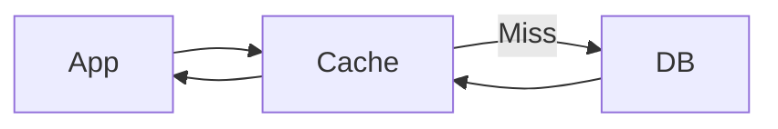

# Cache

> Stores frequently accessed data to reduce latency and database load.

---

## What is it?

A cache is a fast storage layer that keeps frequently requested data in memory so applications don't need to repeatedly query the database.

---

## Why do we need it?

Databases are slower than memory. Caching reduces response time and improves system throughput.

---

## How does it work?

- Check cache
- Return cached data if found
- Fetch from database on a miss
- Store result in cache

---

## Common Configurations

| Setting | Default | Description |
|---|---|---|
| Type | Redis | Cache engine |
| TTL | 300s | Expiry time |
| Eviction | LRU | Removal policy |
| Persistence | Disabled | Save data to disk |

---

## Where is it used?

- User sessions
- Product catalogs
- API responses
- Frequently accessed records

---

## Key Points

- Extremely fast
- Reduces database load
- Improves response time
- Cached data can expire

---

## Related Components

- Application Server
- Database

---

## Learn More

- Cache Aside
- TTL
- Cache Invalidation
