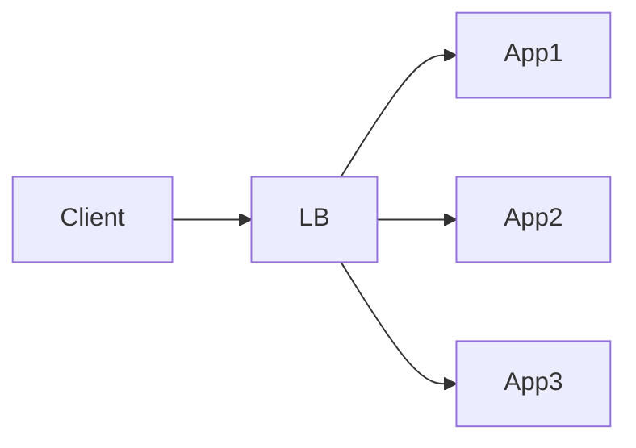

# Load Balancer

> Distributes incoming traffic across multiple backend servers.

---

## What is it?

A load balancer sits in front of your application servers and decides which server should handle each incoming request.

---

## Why do we need it?

Without a load balancer, a single server becomes a bottleneck and single point of failure. Load balancers improve scalability and availability.

---

## How does it work?

- Accepts client traffic
- Chooses a backend
- Performs health checks
- Routes the request

---

## Common Configurations

| Setting | Default | Description |
|---|---|---|
| Algorithm | Round Robin | Routing strategy |
| Health Checks | Enabled | Monitor backend health |
| Sticky Sessions | Disabled | Session affinity |
| SSL Termination | Disabled | HTTPS offloading |

---

## Where is it used?

- Web applications
- APIs
- Microservices
- High availability systems

---

## Key Points

- Improves availability
- Enables horizontal scaling
- Routes requests
- Removes unhealthy servers

---

## Related Components

- Application Server
- Reverse Proxy
- API Gateway

---

## Learn More

- Load Balancing Algorithms
- Layer 4 vs Layer 7
- Health Checks
