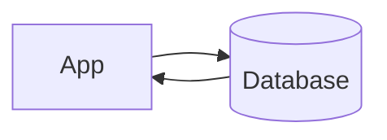

# Database

> Stores application data persistently and reliably.

---

## What is it?

A database is the primary storage layer of an application. It stores information permanently and allows applications to query and update that data.

---

## Why do we need it?

Applications need reliable storage for users, orders, transactions, and other business data that must survive restarts.

---

## How does it work?

- Receives queries
- Reads or writes data
- Stores information durably
- Returns results

---

## Common Configurations

| Setting | Default | Description |
|---|---|---|
| Type | PostgreSQL | Database engine |
| Deployment | Single | Single or Replica |
| Replication | Disabled | High availability |
| Backup | Enabled | Data protection |

---

## Where is it used?

- Banking
- E-commerce
- Social media
- Enterprise software

---

## Key Points

- Persistent storage
- Source of truth
- Supports queries and transactions
- Often paired with caches

---

## Related Components

- Application Server
- Cache

---

## Learn More

- ACID
- Replication
- Sharding
- Indexing
